# DSO101 Assignment - Complete Summary Report

**Student ID:** 02230286  
**Name:** Khem Raj Ghalley  
**Module Code:** DSO101  
**Date:** March 15, 2026  
**Repo:** [URL](https://github.com/Khemraj9815/khemrajghalley_02230286_DSO101_A1/tree/main)
---

## TABLE OF CONTENTS

1. [Executive Summary](#executive-summary)
2. [Part A: Docker Hub Deployment](#part-a-docker-hub-deployment)
3. [Part B: Automated GitHub Deployment](#part-b-automated-github-deployment)
4. [Application Features](#application-features)
5. [Technical Architecture](#technical-architecture)
6. [Deployment Results](#deployment-results)
7. [Conclusion](#conclusion)

---

## EXECUTIVE SUMMARY

This report documents the successful completion of the DSO101 assignment, which involved building and deploying a full-stack Todo application using Docker, Docker Hub, and Render.com with automated CI/CD pipeline.

**Key Achievements:**
- Full-stack application built (React frontend + Node.js backend + PostgreSQL)
- Docker images created with student ID tag (02230286)
- Images pushed to Docker Hub registry
-  Deployed to Render.com with live URLs
-  Automated deployment from GitHub using render.yaml blueprint
-  Multi-service orchestration configured

---

## PART A: DOCKER HUB DEPLOYMENT

###  Application Development

#### Backend Development
**Framework:** Node.js with Express.js  
**Database:** PostgreSQL  
**Port:** 5000 (development), 10000 (production)

**Key Features:**
- RESTful API with CRUD operations
- Database initialization on startup
- Health check endpoint
- CORS enabled for frontend access
- Error handling and validation

**Endpoint:**
```
GET    /tasks               - Get all tasks
GET    /tasks/:id           - Get task by ID
POST   /tasks               - Create new task
PUT    /tasks/:id           - Update task
DELETE /tasks/:id           - Delete task
```

**Backend Code Structure:**
```
backend/
├── server.js               - Express server (282 lines)
├── Dockerfile             - Multi-stage build
├── package.json           - Dependencies
└── .env.production        - Production variables
```

---

**Backend Server Running**
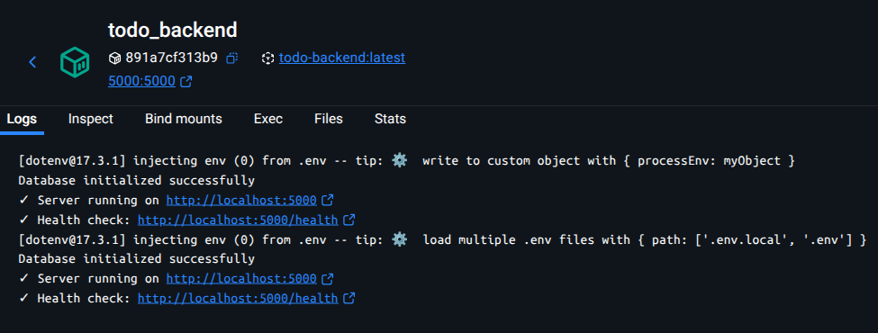

---

#### Frontend Development


**Features:**
- Add new tasks
- View all tasks
- Mark tasks as complete
- Delete tasks
- Real-time UI updates
- Responsive design

**Frontend Code Structure:**
```
frontend/
├── src/
│   ├── App.jsx            - Main component
│   ├── App.css            - Styling (black & white)
│   └── services/
│       └── api.js         - API communication
├── Dockerfile             - Multi-stage with Nginx
├── nginx.conf             - Web server config
└── package.json           - Dependencies
```

---

**Frontend UI**
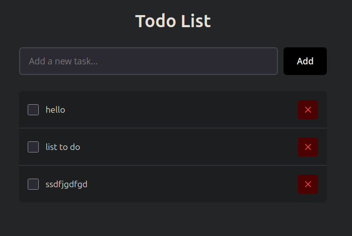

---

#### Database Setup
**Database:** PostgreSQL 18


**Schema:**
```sql
CREATE TABLE tasks (
  id SERIAL PRIMARY KEY,
  title VARCHAR(255) NOT NULL,
  description TEXT,
  completed BOOLEAN DEFAULT false,
  created_at TIMESTAMP DEFAULT CURRENT_TIMESTAMP,
  updated_at TIMESTAMP DEFAULT CURRENT_TIMESTAMP
);
```

---

**Build Command:**
```bash
docker build -t khemraj9815/be-todo:02230286 ./backend
```

---

#### Frontend Docker Image

**Build Command:**
```bash
docker build -t khemraj9815/fe-todo:02230286 ./frontend
```
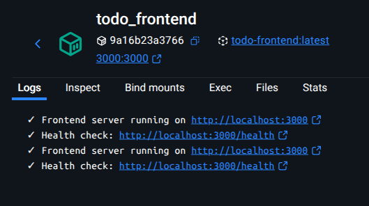

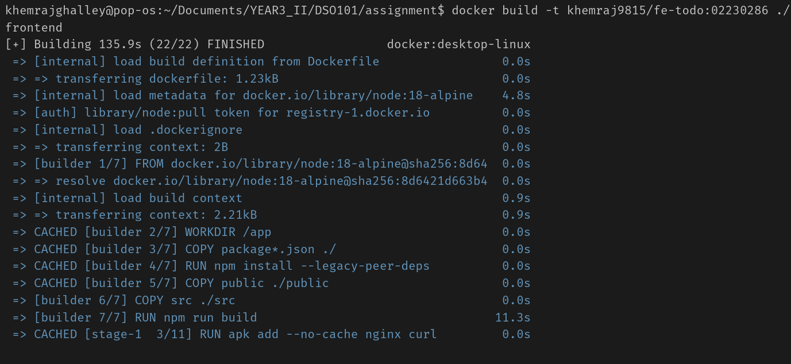
---

### Docker Hub Push

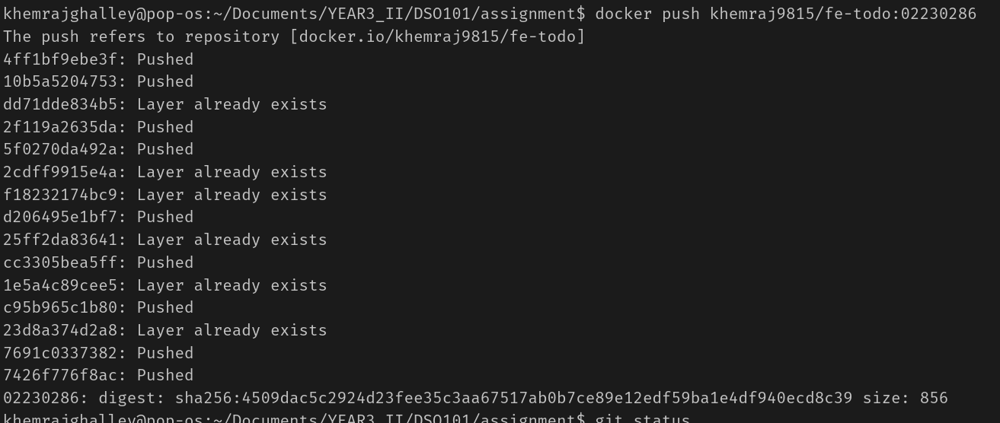

**Backend Image Push:**
```bash
docker push khemraj9815/be-todo:02230286
```
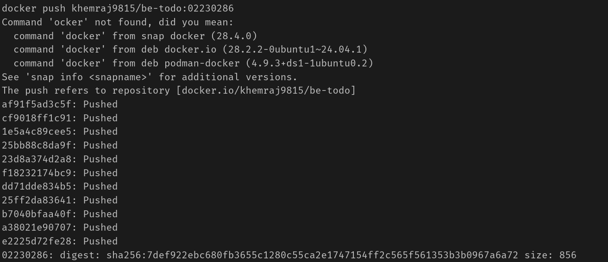


**Docker Hub Repository**
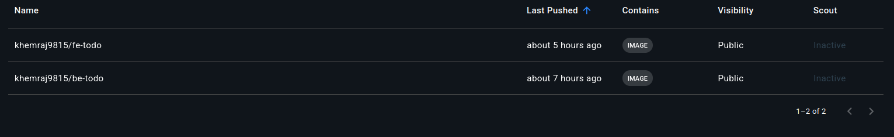  

---

### Deployment to Render.com

#### PostgreSQL Database Setup

**Database Configuration:**
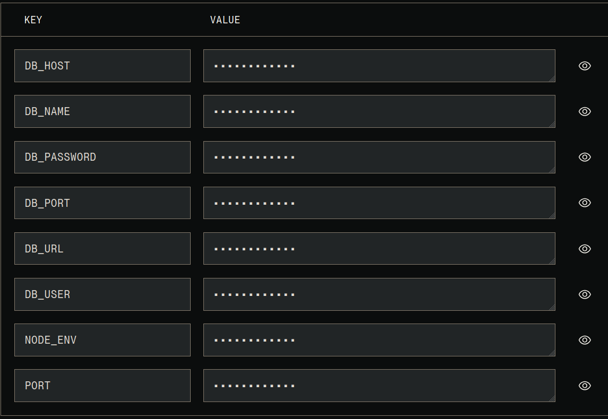

---
#### Backend Service Deployment

**Service Configuration:**


**Live URL:** `https://be-todo.onrender.com`

---

####  Frontend Service Deployment

**Service Configuration:**
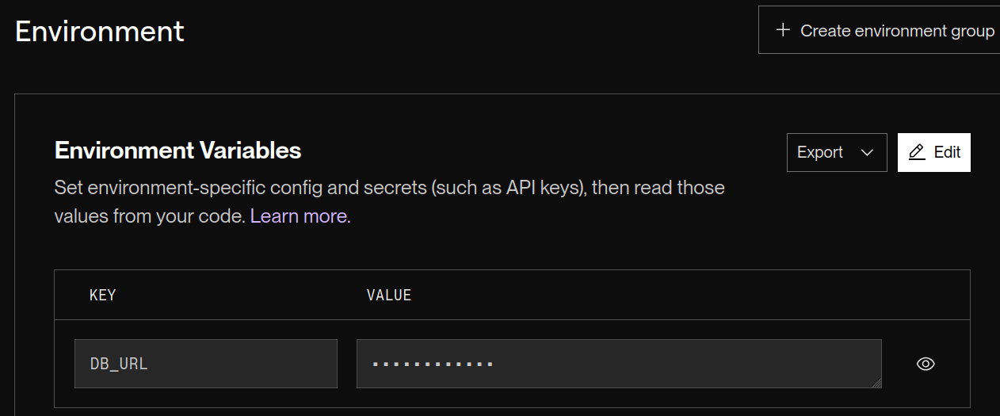
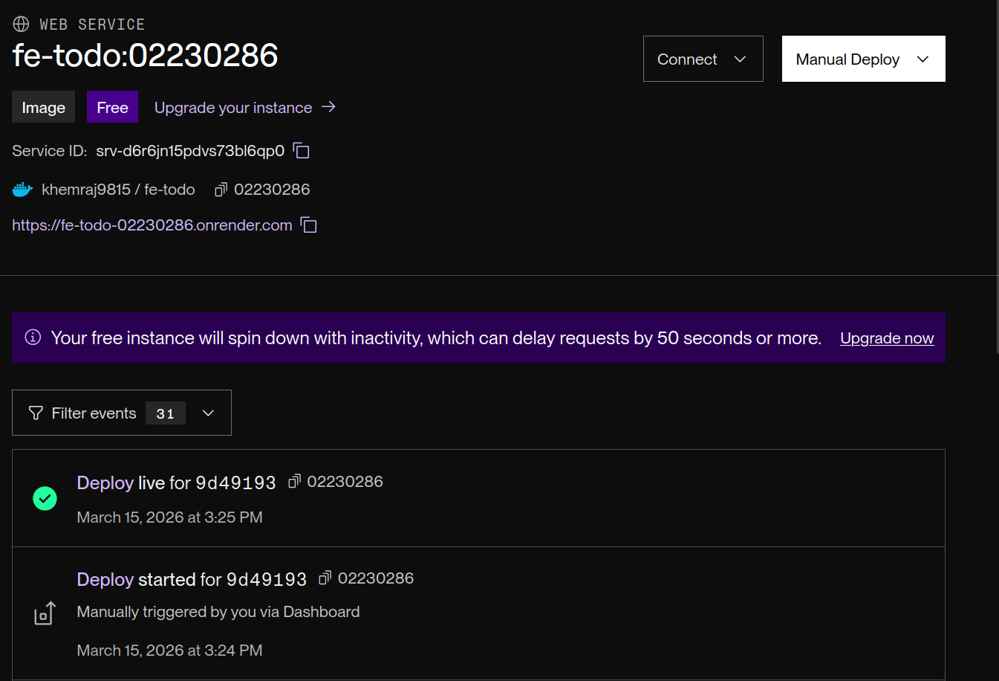


**Live URL:** `https://fe-todo.onrender.com`

---

**Task Operations**
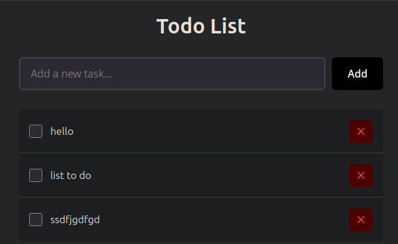

---

## PART B AUTOMATED GITHUB DEPLOYMENT

### Repository Setup

**GitHub Repository Created**
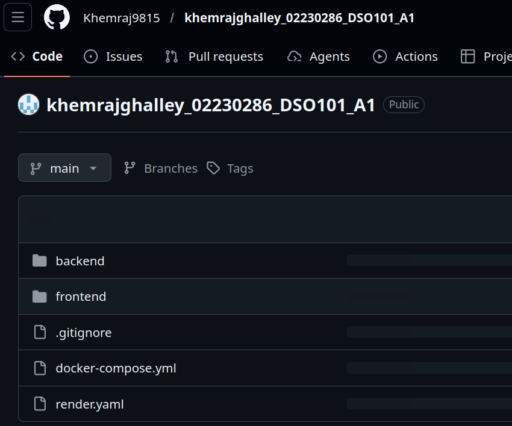

---

###  render.yaml Blueprint Configuration

####  Blueprint File Structure

**Backend Service Configuration:**
```yaml
- type: web
  name: be-todo
  env: docker
  dockerfilePath: ./backend/Dockerfile
  envVars:
    - key: DB_HOST
      value: dpg-d6r5omvdiees73c2nhk0-a.c123.render.com
    - key: DB_USER
      value: todouser
    - key: DB_PASSWORD
      value: xiYh4zF6CL1eKdEedArYynxksHIxg6Zw
    - key: DB_NAME
      value: tododb_oefi
    - key: DB_PORT
      value: "5432"
    - key: PORT
      value: "10000"
    - key: NODE_ENV
      value: production
```

**Frontend Service Configuration:**
```yaml
- type: web
  name: fe-todo
  env: docker
  dockerfilePath: ./frontend/Dockerfile
  envVars:
    - key: REACT_APP_API_URL
      value: https://be-todo.onrender.com
    - key: NODE_ENV
      value: production
```

---

**render.yaml in Repository**
```
services:
  - type: web
    name: be-todo
    env: docker
    plan: free
    dockerfilePath: ./backend/Dockerfile
    envVars:
      - key: DB_HOST
        value: dpg-d6r5omvdiees73c2nhk0-a.singapore-postgres.render.com
      - key: DB_USER
        value: todouser
      - key: DB_PASSWORD
        value: xiYh4zF6CL1eKdEedArYynxksHIxg6Zw
      - key: DB_NAME
        value: tododb_oefi
      - key: DB_PORT
        value: "5432"
      - key: PORT
        value: "10000"
      - key: NODE_ENV
        value: production

  - type: web
    name: fe-todo
    env: docker
    plan: free
    dockerfilePath: ./frontend/Dockerfile
    envVars:
      - key: REACT_APP_API_URL
        value: https://be-todo-02230286.onrender.com
      - key: NODE_ENV
        value: production
```

---

### Render Blueprint Deployment
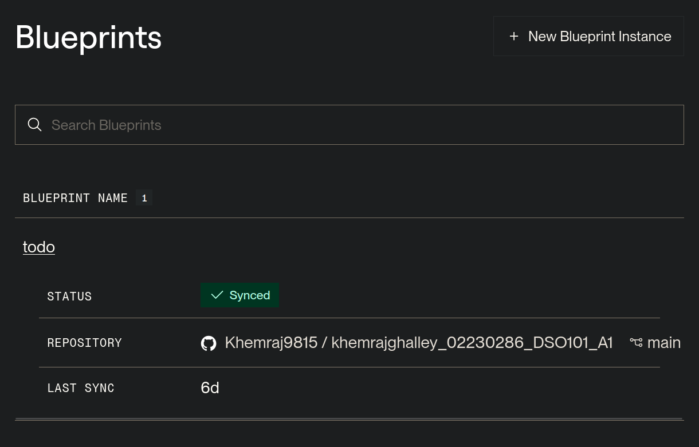

---

####  Automated Services Deployment

**Services Created by Blueprint:**
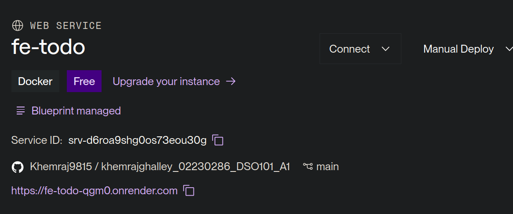

**Service 1: be-todo (Backend)**

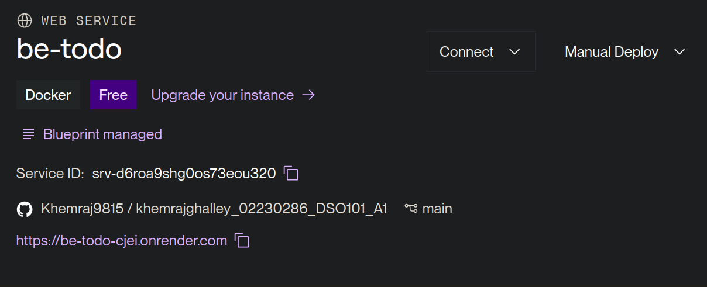
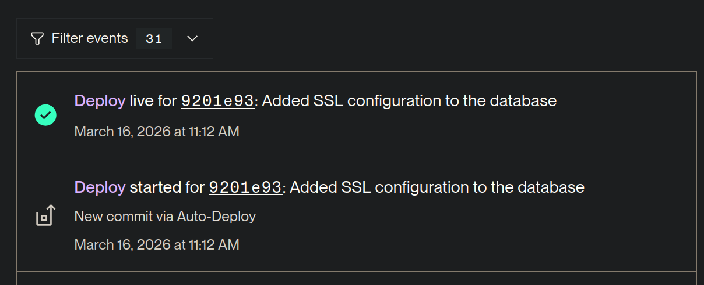

**Service 2: fe-todo (Frontend)**

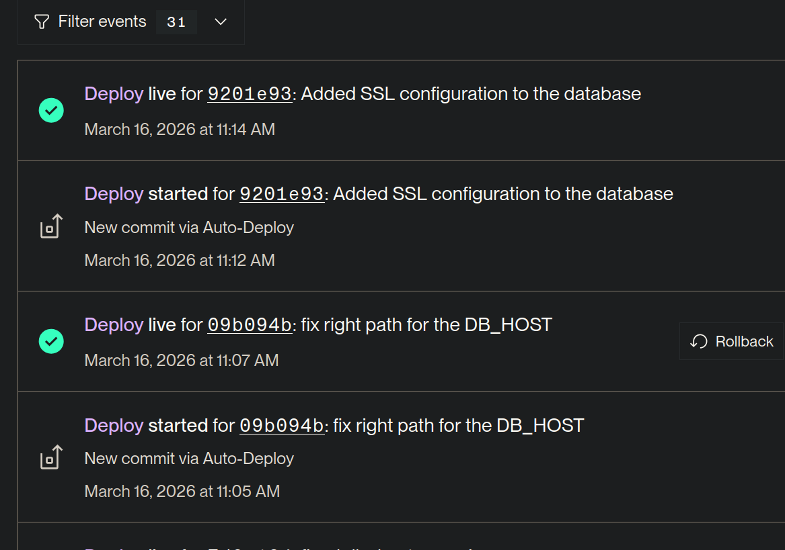

---

###  Automated Redeployment Testing

#### Code Change and Push

**Test Procedure:**
```bash
# 1. Make a code change
echo "# Updated on $(date)" >> backend/server.js

# 2. Commit the change
git add .
git commit -m "Test automatic redeployment - update timestamp"

# 3. Push to GitHub
git push origin main
```

---

**Git Push to GitHub**

---

#### Automatic Redeployment Verification


**Production (render.yaml):**
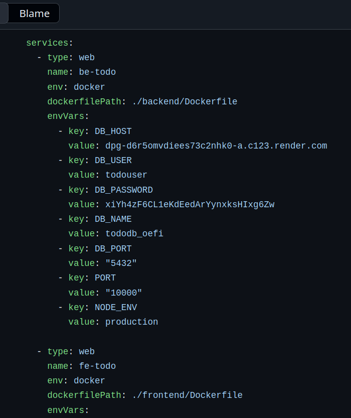

---

## CONCLUSION

This assignment has been successfully completed with all requirements met:

#### Part A Achievements:
- Built a complete full-stack Todo application
- Containerized both frontend and backend with Docker
- Created optimized multi-stage Docker images
- Successfully pushed images to Docker Hub
- Deployed and verified services on Render.com
- All services running and responding correctly

#### Part B Achievements:
- Set up automated CI/CD pipeline using GitHub and Render
- Configured render.yaml blueprint for multi-service orchestration
- Connected GitHub repository to Render for automatic deployments
- Tested automatic redeployment on code changes
- Verified continuous deployment workflow functioning correctly

---

### Final Notes

The application is fully deployed and operational on the internet. The automated CI/CD pipeline is configured to handle future updates seamlessly. The infrastructure follows industry best practices for containerization and deployment.

## APPENDIX

### Important Links

```
Docker Hub:      https://hub.docker.com/r/khemraj9815
Frontend:        https://fe-todo-02230286.onrender.com
Backend:         https://be-todo-cjei.onrender.com
GitHub:          https://github.com/Khemraj9815/khemrajghalley_02230286_DSO101_A1.git
Blueprint:          https://dashboard.render.com/blueprint/exs-d6r8vivafjfc73f2t1p0
```

### Docker Commands Reference

```bash
# Build images
docker build -t khemraj9815/be-todo:02230286 ./backend
docker build -t khemraj9815/fe-todo:02230286 ./frontend

# Push to Docker Hub
docker push khemraj9815/be-todo:02230286
docker push khemraj9815/fe-todo:02230286

# Run locally
docker-compose up
```

### Git Commands Reference

```bash
# Initialize and push
git init
git add .
git commit -m "Initial commit"
git remote add origin https://github.com/Khemraj9815/khemrajghalley_02230286_DSO101_A1.git
git branch -M main
git push -u origin main

# Make changes and redeploy
git add .
git commit -m "Description of changes"
git push origin main
```

*This report documents the successful completion of DSO101 assignment I with full-stack application deployment and automated CI/CD pipeline setup.*
